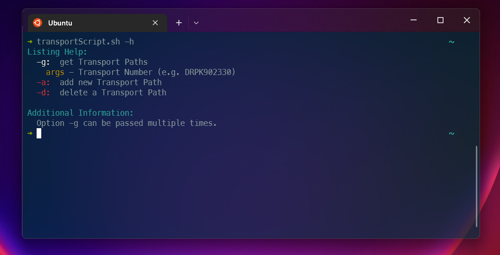
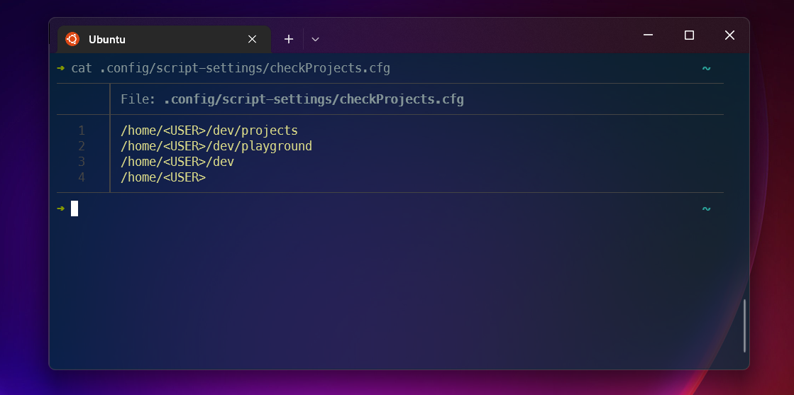

# Bash Scripts

Custom Scripts that help with my everyday Workflow.

---

## Post Installation:

### Display Colors

add a line that references the color include in your shell, 
so the scripts can run correctly.

```sh
    export BASH_COLOR_INCL=~/.local/bin/includes/incl.Colors
```

### Display Icons

To correctly display Icons, first step would be to use a Nerd Font, afterwards
clone the nerd-font github repo and follow the corresponding [Wiki entry](https://github.com/ryanoasis/nerd-fonts/wiki/Icon-Names-in-Shell)
when the scripts are available at **~/.local/share/fonts**, then add
the following environment variable to your shell '*rc' file.

```sh
    export BASH_ICON_INCL=~/.local/bin/includes/
```

The different scripts have there own include files now, so no unnecessary icons get loaded.
When icons are included within a script there should be a ```incl.Icons.<script-name>``` File within the **includes** directory.

In case you want to source the Icons in your own script, you case use the following to source every Icon,
or create your own include file with the help of a existing ```incl.Icons.<script-name>``` file.
```sh
    source $BASH_ICON_INCL/incl.Icons
```

---

## General Information:

Options that are marked with red, are not yet implemented.



---

## Script Information:

### auditProjects.sh

audit npm / pnpm projects for outdated packages & vulnerabilities.
Uses the current directory & checks the sub-directories, 
execute with option **-l** to see what directories would be checked.

---

### checkCommit.sh

check if upstream is ahead, behind or identical, requires a git remote as a argument.

---

### checkGitHooks.sh

check available git hook content, enables replacment / insert for multiple projects.

---

### checkProjects.sh

checks the **checkProjects.cfg** file within **~/.config/script-settings**. Here you can list
your parent project directories, and the sub-directories will be checked.



---

### createProject.sh

with this script you can create local, raspberry pi, github projects. 
- for github projects gh cli, is needed.
- for raspberry pi, the sshData.cfg file (see [`gitAddRemote`](#gitaddremotesh)) has to be configured

---

### gitAddRemote.sh

with this script u can replace git remotes, with the corresponding ssh config.
create the **sshData.cfg** file with option -c. 

---

### gitNewRepository.sh

script for raspberry pi, that create's a repository according to specific rules.
gets called by createProject, when correctly configured. Special creation is needed
for the the raspiRepositorySelector.sh script. And because shorter remote path's are nice.

---

### logTransports.sh

document transport files created by SAP System. For the specified Customers. 

---

### prpScript.sh

with this script you can set automatic commit messages, for faster workflow.
decide between homeOffice & work.

---

### pushProjects.sh

with this script you can pushProjects, that were documented within **~/.local/share/script-settings/pushProjects.cfg**
with the help of a post-commit hook. The [`checkGitHooks`](#checkgithookssh) can be used to insert the hook easily

Example of post-commit hook:

```sh
    echo $PWD >> $HOME/.local/share/script-settings/pushProjects.cfg
```

---

### raspiRepositorySelector.sh

not yet implmented.

---

### setupDotFiles.sh

when executed in the home directory **cd ~**, the corresponding config files get linked.

---

### transportScript

build the corresponding transport path's for a sap system, according to a given transport.
the script will help you build the config file.

---

### vim.sh

Helper Script, enables .config for vim settings.

---

### ide.sh & ideSide.sh

Helper Scripts, that open tmux windows.

- ide.sh - opens three panels at the bottom of the screen.
- ideSide.sh - opens single panel at the right side of the screen.

---

